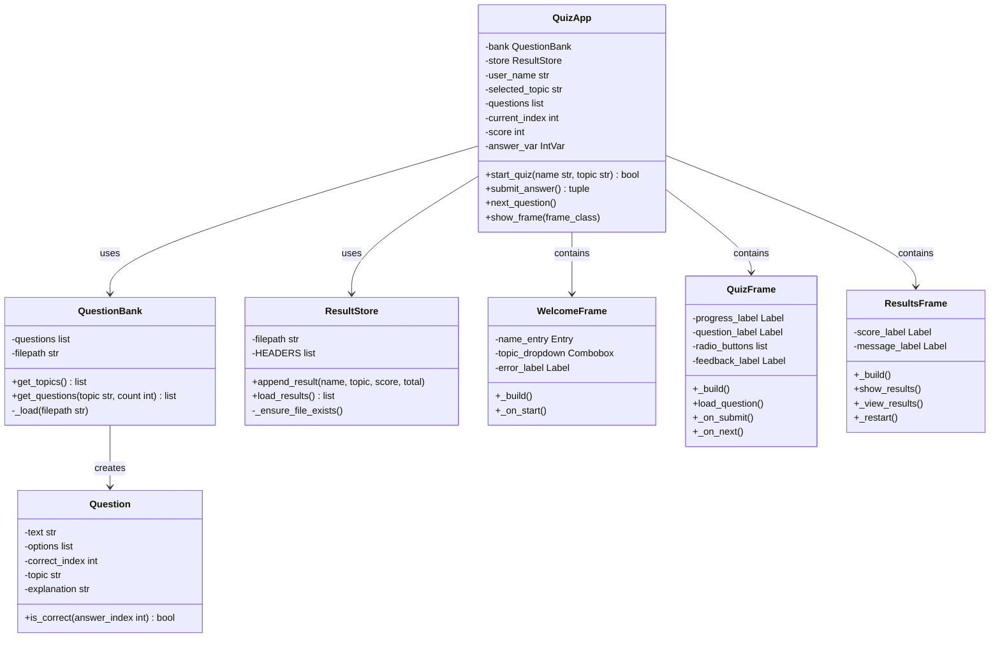
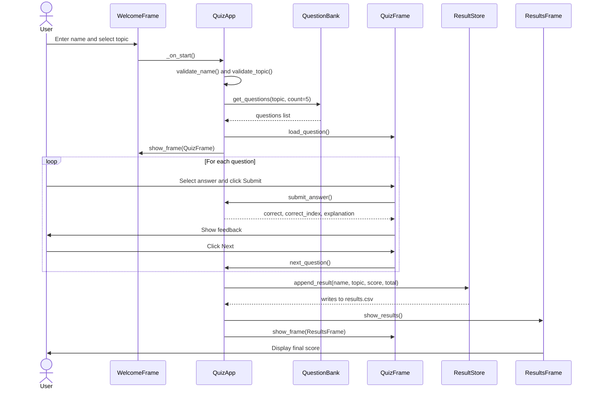
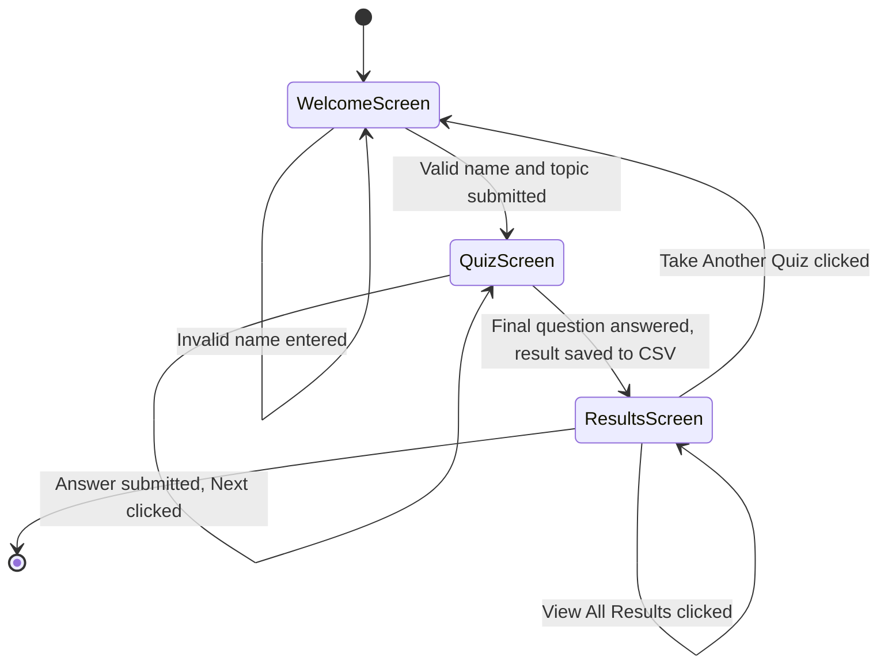

# Macroeconomic Surveillance Quiz

---

## Table of Contents

- [1. Introduction](#1-introduction)
- [2. Design](#2-design)
- [3. Development](#3-development)
- [4. Testing](#4-testing)
- [5. Documentation](#5-documentation)
- [6. Evaluation](#6-evaluation)

---

## 1. Introduction

I work as a Senior research assistant mainly focusing on macroeconomic surveillance within 
North America, emerging market and Asia regions. The teams I work closely with work wil 
indicators such as GDP growth, trade balance, inflation indices and exchange rates. 
Any new joiners are expected to understand the mathematical calculations that underpin
these indicators. 

To support this, I developed a simple quiz programmed in Python and using Tkinter. 
The application tests users on five core topics related to GDP, growth rate, trade balance
exchange rate. Each topic has five multiple choice questions, giving total of 25 questions
for this quiz.

For the application, this is a Minimum viable product (MVP) designed to meet all core requirements
for this assessment. There is no installation required beyond python and results are saved
automatically to a CSV file after every attempt, which analysts can export and use for training
monitoring purposes.With the code stored on Github and features added incrementally followed by 
unit testing via pytest. 

---

## 2. Design

### 2.1 GUI Design

The interface includes three sections the user follows this order to navigate Welcome screen > Quiz screen> results screen.

**Welcome Screen**
- Name entry field
- Topic dropdown (populated from `questions.json`)
- Inline error message if name is invalid
- Start Quiz button


**Quiz Screen**
- Progress label (e.g. "Question 2 of 5 | Topic: GDP")
- Question text
- Four radio buttons for answer options
- Submit Answer button
- Feedback label showing correct or incorrect and an explanation
- Next button to advance


**Results Screen**
- Final score as a fraction and percentage
- Motivational message based on score
- View All Results button (opens a scrollable history window)
- Take Another Quiz button


### 2.2 Functional and Non-Functional Requirements

**Functional Requirements**

| ID | Requirement |
|---|---|
| F1 | The application must present multiple-choice questions one at a time |
| F2 | The user must be able to select a topic before starting |
| F3 | The application must show whether the answer was correct immediately |
| F4 | Results must be saved to a CSV file automatically after each attempt |
| F5 | The user must be able to view all past results within the application |
| F6 | Input validation must prevent empty or invalid names from being submitted |

**Non-Functional Requirements**

| ID | Requirement |
|---|---|
| N1 | The application must run on any machine with Python 3.9+ installed |
| N2 | No external libraries should be required |
| N3 | The interface must be usable by someone with no technical background |
| N4 | The CSV file must be readable in Excel without any conversion |


Tkinter was chosen over Flash or Streamnlit due to this being part of Python
making the application run easily without further installs which makes it
easy and straightforward for analysts. 

### 2.4 Class Diagram



### 2.5 Sequence Diagram

### 2.6 Application Flow

---

## 3. Development

### 3.1 Question and QuestionBank

The `Question` class stores a single quiz item. The `is_correct()` method
returns `True` if the selected index matches the correct answer.

```python
class Question:
    def __init__(self, text, options, correct_index, topic, explanation=""):
        self.text = text
        self.options = options
        self.correct_index = correct_index
        self.topic = topic
        self.explanation = explanation

    def is_correct(self, answer_index: int) -> bool:
        # Compare selected answer to correct answer
        return answer_index == self.correct_index
```

`QuestionBank` loads all questions from `questions.json` on initialisation.
`get_questions()` filters by topic and returns a random selection. If more
questions are requested than are available, a `ValueError` is raised.**To note
for questions.json all 25 questions are AI generated from chatgpt**

```python
def get_questions(self, topic: str = None, count: int = 5) -> list:
    # Filter by topic if one was given, otherwise use all questions
    if topic:
        pool = [q for q in self.questions if q.topic == topic]
    else:
        pool = self.questions
    # Check we have enough questions before trying to pick
    if count > len(pool):
        raise ValueError(
            f"Requested {count} questions however, only {len(pool)} available "
            f"for topic '{topic}'."
        )
    # Pick randomly so the quiz is different each time
    return random.sample(pool, count)
```

### 3.2 ResultStore

`ResultStore` handles all CSV interaction. On first run it creates the file
with the correct headers. `append_result()` writes one row per completed
attempt, stamped with the current date and time.

```python
def append_result(self, name: str, topic: str, score: int, total: int) -> None:
    row = {
        "name": name,
        "date": datetime.now().strftime("%Y-%m-%d %H:%M"),
        "topic": topic,
        "score": score,
        "total": total
    }
    # Open in append mode so existing records are not overwritten
    with open(self.filepath, "a", newline="") as f:
        writer = csv.DictWriter(f, fieldnames=self.HEADERS)
        writer.writerow(row)
```

### 3.3 Validators

input validation uses functions in `validators.py` this was done to ensure
easy and straightforward testing.
```python
def validate_name(name: str) -> bool:
    # Reject empty strings, whitespace-only and names over 60 characters
    if not isinstance(name, str):
        return False
    stripped = name.strip()
    return 0 < len(stripped) <= 60
```

### 3.4 Tkinter GUI
The application uses three `tk.Frame` screens stacked on top of each other, 
`tkraise()` brings the frame to the front if relevant and when needed. 
QuickApp holds all the application instances attributes.

```python
  # Create all frames
        self.welcome_frame = WelcomeFrame(self.root)
        self.quiz_frame = QuizFrame(self.root)
        self.results_frame = ResultsFrame(self.root)

        self.welcome_frame.grid(row=0, column=0, sticky="nsew" )
        self.quiz_frame_frame.grid(row=0, column=0, sticky="nsew" )
        self.results_frame.grid(row=0, column=0, sticky="nsew" )
        self.show_frame(self.welcome_frame)
```

---

## 4. Testing

### 4.1 Testing Strategy

For testing, I used two methods first was automated unit testing with pytest for
all logic that isn't dependant on the GUI such as, validator functions, the 
`Question` class and `ResultStore`. Manual testing was used to verify GUI
behavior such as screen transitions, feedback message and results window.

### 4.2 Manual Test Outcomes

| Test | Steps | Expected Result | Actual Result | Pass/Fail |
|---|---|---|---|---|
| Empty name rejected | Leave name blank, click Start | Error message appears | Error message appeared |  Pass |
| Valid name accepted | Enter "Test User", click Start | Quiz screen loads | Quiz screen loaded |  Pass |
| Wrong answer feedback | Select wrong answer, submit | Red feedback with correct answer | Correct |  Pass |
| Correct answer feedback | Select correct answer, submit | Green "Correct!" message | Correct |  Pass |
| Score saved to CSV | Complete a quiz | New row in results.csv | Row written correctly |  Pass |
| View All Results | Click View All Results | Scrollable window with history | Opened correctly | Pass |
| Take Another Quiz | Click Take Another Quiz | Returns to Welcome screen | Returned correctly |  Pass |

### 4.3 Unit Test Outcomes
The test contained 19 test cases across four modules, all 19 passed as seen below.

```
tests/test_question.py::test_question_stores_text          PASSED
tests/test_question.py::test_correct_answer                PASSED
tests/test_question.py::test_wrong_answer                  PASSED
tests/test_question.py::test_topic_stored                  PASSED
tests/test_question.py::test_explanation_defaults_empty    PASSED
tests/test_question_bank.py::test_loads_questions          PASSED
tests/test_question_bank.py::test_get_topics_return_list   PASSED
tests/test_question_bank.py::test_filter_by_topics         PASSED
tests/test_question_bank.py::tests_raise_if_count_too_high PASSED
tests/test_question_bank.py::test_missing_file_raises_error PASSED
tests/test_result_store.py::test_file_created_on_init      PASSED
tests/test_result_store.py::test_multiple_results          PASSED
tests/test_result_store.py::test_empty_file_returns_empty_list PASSED
tests/test_validators.py::test_valid_named                 PASSED
tests/test_validators.py::test_emptpy_name                 PASSED
tests/test_validators.py::test_whitespace_only             PASSED
tests/test_validators.py::test_name_too_long               PASSED
tests/test_validators.py::test_valid_topic                 PASSED
tests/test_validators.py::test_invalid_topic               PASSED

19 passed
```


---

## 5. Documentation

### 5.1 User Documentation

**How to start the application**

1. Ensure Python 3.9 or later is installed
2. Open a terminal and navigate to the project folder
3. Run `python quiz_app.py`

**Taking a quiz**

1. Enter your name in the text field
2. Select a topic from the dropdown
3. Click Start Quiz
4. For each question, select one of the four options and click Submit Answer
5. Read the feedback, then click Next to continue
6. Your final score is shown at the end of the session

**Viewing and exporting results**

- Click View All Results on the results screen to see all past attempts
- The `results.csv` file in the project folder can be opened directly in Excel
  and submitted as appraisal evidence

### 5.2 Technical Documentation

**Running tests locally**

```
pytest tests/ -v
```

**Project structure**

```
macro_quiz/
├── quiz_app.py         — Tkinter GUI and application entry point
├── question.py         — Question class
├── question_bank.py    — Loads and filters questions
├── result_store.py     — Saves and reads results to CSV
├── validators.py       — Pure input validation functions
├── questions.json      — All 25 quiz questions
├── tests/              — pytest test suite

```

**Adding new questions**

Open `questions.json` and add a new entry following this format:

```json
{
  "text": "Your question here?",
  "options": ["Option A", "Option B", "Option C", "Option D"],
  "correct_index": 0,
  "topic": "GDP",
  "explanation": "Brief explanation of the correct answer."
}
```

`correct_index` is 0 for A, 1 for B, 2 for C and 3 for D. To add
questions, there is no code needed the user needs to update the JSON
file.

---

## 6. Evaluation
Overall, I found this a bit challenging at parts, such as understanding how to
structure classes, functions and files. I found that by having functions stored
in separate files, testing was far more straightforward. Furthermore, by having all 
the logic classes set up first and testing this before GUI development made the 
process a lot more smoother.

Choose Tkinter was the appropriate decision as I felt more comfortable using Tkinter
instead of Flask. It taught me how GUI events loop and widget state in a practical way.
Working through indentation errors proved a bit more difficult as I found I found that
after each line I would have a habit of pressing space button twice, which would alter 
class structure. This is habit I noticed in my own work place when using R despite 
this flaw, I found it helpful to understand how python handles objects and scope.

Due to the sections I found challenging I found myself relying on searching for solutions
online, through forums and help pages. This is a reflection I found interesting during the
project.

There are things I would improve with more time and understanding given my learning 
abilities. The application has no timer, which means questions are un-timed and do
not reflect the pressure of real quiz settings. There isn't a GUI for adding new 
questions, making this process requiring editing the JSON file directly. Which
could be a barrier for some who are less technical.

---

## References

- [Python Tkinter documentation](https://docs.python.org/3/library/tkinter.html)
- [pytest documentation](https://docs.pytest.org)
